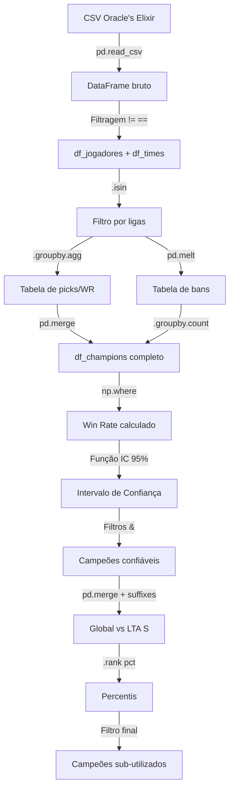

# Conceitos Aplicados — Notebook `picks.ipynb`

Este documento detalha **todos os conceitos de Python, pandas, NumPy, SciPy e estatística** utilizados no notebook de análise de picks/bans de LoL Esports 2025.

---

## 1. Importação de Bibliotecas

```python
import pandas as pd
import numpy as np
from scipy import stats
```

| Biblioteca | Finalidade no projeto |
|---|---|
| **pandas** | Manipulação e análise de dados tabulares (DataFrames) |
| **NumPy** | Operações matemáticas vetorizadas (cálculos eficientes em arrays) |
| **SciPy (stats)** | Funções estatísticas — usado para calcular o z-score do intervalo de confiança |

---

## 2. Leitura de Dados com `pd.read_csv()`

```python
dados2025 = pd.read_csv('...caminho...', low_memory=False)
```

- **`pd.read_csv()`** — Lê um arquivo CSV e converte para um DataFrame do pandas
- **`low_memory=False`** — Força o pandas a ler o arquivo inteiro de uma vez antes de decidir os tipos das colunas, evitando o `DtypeWarning` que aparece quando há tipos mistos em uma coluna

---

## 3. Filtragem de DataFrames com Condições Booleanas

```python
df_jogadores_total = dados2025[dados2025['position'] != 'team']
df_times_total = dados2025[dados2025['position'] == 'team']
```

### Como funciona:
1. `dados2025['position'] != 'team'` → Cria uma **Series booleana** (True/False para cada linha)
2. `dados2025[...]` → Usa essa Series como máscara: mantém apenas linhas onde o resultado é `True`

### Operadores de comparação:
| Operador | Significado | Exemplo |
|---|---|---|
| `==` | Igual | `df['col'] == 'valor'` |
| `!=` | Diferente | `df['col'] != 'valor'` |
| `>`, `<` | Maior/Menor | `df['col'] > 10` |
| `>=`, `<=` | Maior ou igual / Menor ou igual | `df['col'] >= 0.53` |

---

## 4. Método `.isin()` — Filtro por Lista de Valores

```python
ligas_desejadas = ['LCKC', 'LCK', 'LCP', 'LEC', 'TCL', 'LTA N', 'PCS', 'LTA', 'VCS', 'LPLOL']

df_jogadores = df_jogadores_total[df_jogadores_total['league'].isin(ligas_desejadas)]
```

- **`.isin(lista)`** — Retorna `True` para cada linha cuja coluna contém um dos valores da lista
- É equivalente a encadear vários `==` com `|` (OR), mas **muito mais limpo e eficiente**
- Exemplo equivalente (mais verboso):
  ```python
  df[(df['league'] == 'LCK') | (df['league'] == 'LEC') | ...]
  ```

---

## 5. Funções em Python (`def`)

```python
def gerar_df_champions(ligas_desejadas, dados=dados2025):
    ...
    return df_champions
```

### Conceitos:
- **`def`** — Define uma função reutilizável
- **Parâmetros posicionais** — `ligas_desejadas` (obrigatório)
- **Parâmetros com valor padrão** — `dados=dados2025` (opcional, usa `dados2025` se não informado)
- **`return`** — Retorna o resultado da função

### Por que usar funções?
No notebook, `gerar_df_champions()` é chamada **duas vezes** com argumentos diferentes:
```python
df_lta = gerar_df_champions(['LTA S'])        # Para a LTA S
df_champions = gerar_df_champions(ligas_desejadas)  # Para o pool global
```
Isso evita duplicação de código — toda a lógica de picks/bans/WR/IC é escrita **uma única vez**.

---

## 6. `.groupby().agg()` — Agregação de Dados

```python
df_champions = df_jogadores.groupby('champion').agg({
    'result': 'sum',
    'league': 'count'
}).reset_index()
```

### Passo a passo:
1. **`.groupby('champion')`** — Agrupa todas as linhas pelo nome do campeão
2. **`.agg({...})`** — Aplica funções de agregação diferentes por coluna:
   - `'result': 'sum'` → Soma os resultados (1 = vitória, 0 = derrota) → total de vitórias
   - `'league': 'count'` → Conta as linhas → total de partidas
3. **`.reset_index()`** — Transforma o índice de grupo de volta em coluna normal

### Funções de agregação comuns:
| Função | O que faz |
|---|---|
| `'sum'` | Soma dos valores |
| `'count'` | Contagem de linhas |
| `'mean'` | Média |
| `'min'` / `'max'` | Mínimo / Máximo |
| `'nunique'` | Contagem de valores únicos |

---

## 7. `.rename()` — Renomear Colunas

```python
df_champions = df_champions.rename(columns={'result': 'vitorias', 'league': 'partidas'})
```

- Recebe um dicionário `{'nome_antigo': 'nome_novo'}` para renomear colunas
- Não modifica o DataFrame original (a menos que se use `inplace=True`)

---

## 8. `pd.melt()` — Transformação de Wide para Long (Unpivot)

```python
colunas_ban = ['ban1', 'ban2', 'ban3', 'ban4', 'ban5']

df_bans = pd.melt(df_times,
                  id_vars=['gameid', 'league'],
                  value_vars=colunas_ban,
                  var_name='ban_position',
                  value_name='champion_banido')
```

### Antes (formato wide — uma coluna para cada ban):
| gameid | ban1 | ban2 | ban3 | ban4 | ban5 |
|---|---|---|---|---|---|
| 001 | Zyra | Poppy | Taliyah | Maokai | Annie |

### Depois (formato long — uma linha para cada ban):
| gameid | ban_position | champion_banido |
|---|---|---|
| 001 | ban1 | Zyra |
| 001 | ban2 | Poppy |
| 001 | ban3 | Taliyah |
| 001 | ban4 | Maokai |
| 001 | ban5 | Annie |

### Parâmetros:
| Parâmetro | Significado |
|---|---|
| `id_vars` | Colunas que identificam cada linha (ficam fixas) |
| `value_vars` | Colunas que serão "derretidas" em linhas |
| `var_name` | Nome da nova coluna com os nomes das variáveis |
| `value_name` | Nome da nova coluna com os valores |

---

## 9. `pd.merge()` — Junção de DataFrames (JOIN)

```python
df_champions = pd.merge(df_champions, champions_banidos,
                        left_on='champion', right_on='champion_banido',
                        how='left')
```

### Conceito:
Funciona como um **JOIN** em SQL — combina duas tabelas baseado em colunas em comum.

### Parâmetros:
| Parâmetro | Significado |
|---|---|
| `left_on` | Coluna-chave do DataFrame da esquerda |
| `right_on` | Coluna-chave do DataFrame da direita |
| `on` | Quando a coluna-chave tem o **mesmo nome** nos dois DataFrames |
| `how` | Tipo de junção |
| `suffixes` | Sufixos adicionados a colunas com nomes duplicados |

### Tipos de JOIN (`how`):
| Tipo | Comportamento |
|---|---|
| `'left'` | Mantém todas as linhas do DF esquerdo |
| `'right'` | Mantém todas as linhas do DF direito |
| `'inner'` | Mantém apenas linhas com correspondência nos dois |
| `'outer'` | Mantém todas as linhas de ambos |

### Uso avançado com suffixes:
```python
df_merged = pd.merge(df_champions, df_lta, on='champion', how='left', suffixes=('_g', '_lta'))
```
Quando ambos os DataFrames têm colunas com o mesmo nome (como `win rate %`), o pandas adiciona sufixos para diferenciá-las: `win rate %_g` e `win rate %_lta`.

---

## 10. `.drop()` — Remover Colunas

```python
.drop(columns=['champion_banido'])
```

- Remove colunas que não são mais necessárias após o merge

---

## 11. `.fillna()` e `.astype()` — Tratamento de Valores Nulos e Tipos

```python
df_champions['bans'] = df_champions['bans'].fillna(0)
df_champions['bans'] = df_champions['bans'].astype(int)
```

- **`.fillna(0)`** — Substitui valores `NaN` (nulos) por 0. Campeões que nunca foram banidos ficam com NaN após o merge left; esse comando corrige isso.
- **`.astype(int)`** — Converte o tipo da coluna para inteiro (pois `fillna` mantém como float)

---

## 12. `np.where()` — Condicional Vetorizada

```python
df_champions['win rate %'] = np.where(
    df_champions['partidas'] > 0,
    df_champions['vitorias'] / df_champions['partidas'],
    0
).round(2)
```

### Estrutura:
```python
np.where(condição, valor_se_verdadeiro, valor_se_falso)
```

- É o equivalente vetorizado de um `if/else`
- Neste caso: se `partidas > 0`, calcula o win rate; senão, retorna 0 (evita divisão por zero)
- **`.round(2)`** — Arredonda para 2 casas decimais

---

## 13. `.nunique()` — Contagem de Valores Únicos

```python
total_jogos = df_times['gameid'].nunique()
```

- Conta quantos valores **distintos** existem na coluna
- Aqui, conta o total de jogos únicos (cada `gameid` representa uma partida)

---

## 14. `.sort_values()` — Ordenação

```python
df_champions.sort_values(by='presence rate %', ascending=False)
```

| Parâmetro | Significado |
|---|---|
| `by` | Coluna(s) para ordenar |
| `ascending=False` | Ordem decrescente (maior → menor) |
| `ascending=True` | Ordem crescente (menor → maior) — padrão |

---

## 15. Intervalo de Confiança (IC) de 95% — Conceito Estatístico

```python
def calcular_ic(p, n, confianca=0.95):
    z = stats.norm.ppf((1 + confianca) / 2)
    erro_padrao = np.sqrt((p * (1 - p)) / n)
    margem_erro = z * erro_padrao

    ic_inf = max(0, p - margem_erro)
    ic_sup = min(1, p + margem_erro)
    amplitude = ic_sup - ic_inf

    return ic_inf, ic_sup, amplitude
```

### O que é:
O **Intervalo de Confiança** é uma faixa de valores que indica onde o **verdadeiro** win rate de um campeão provavelmente está, dado o tamanho da amostra.

### Fórmula aplicada (proporção binomial com aproximação normal):
```
IC = p ± z * √(p(1-p)/n)
```

| Variável | Significado |
|---|---|
| `p` | Proporção observada (win rate da amostra) |
| `n` | Tamanho da amostra (número de partidas) |
| `z` | Valor crítico da distribuição normal (1.96 para 95%) |
| `erro_padrao` | Dispersão esperada da proporção amostral |
| `margem_erro` | Margem ± ao redor de `p` |

### `stats.norm.ppf()` — Percent Point Function:
- Dado um percentil da distribuição normal, retorna o z-score correspondente
- `ppf(0.975)` retorna ~1.96 (valor z para 95% de confiança bilateral)

### Por que usar IC:
- Um campeão com **58% de WR em 400 partidas** é estatisticamente muito diferente de **58% de WR em 5 partidas**
- A **amplitude do IC** mede essa confiabilidade: IC apertado (0.08) = confiável; IC largo (0.73) = inconclusivo

### Funções Python usadas:
| Função | O que faz |
|---|---|
| `np.sqrt()` | Raiz quadrada |
| `max(0, ...)` | Limita o valor inferior a 0 (WR não pode ser negativo) |
| `min(1, ...)` | Limita o valor superior a 1 (WR não pode ser > 100%) |
| `round()` | Arredondamento |

---

## 16. Iteração com `for` e `.loc[]` — Acesso Indexado

```python
for idx in df_champions.index:
    p = df_champions.loc[idx, 'win rate %']
    n = df_champions.loc[idx, 'partidas']
    ic_inf, ic_sup, amp = calcular_ic(p, n)

    df_champions.loc[idx, 'amplitude_ic'] = round(amp, 2)
```

### Conceitos:
- **`df.index`** — Retorna os índices (rótulos das linhas) do DataFrame
- **`.loc[idx, 'coluna']`** — Acessa/modifica o valor em uma linha e coluna específicas pelo **rótulo**
- **Desempacotamento de tupla** — `ic_inf, ic_sup, amp = calcular_ic(p, n)` atribui os 3 valores retornados a 3 variáveis

---

## 17. Filtros Combinados com `&` (AND)

```python
df_champions = df_champions[
    (df_champions['partidas'] > 25) &
    (df_champions['amplitude_ic'] <= 0.20)
]
```

### Regras:
- **`&`** → AND lógico (ambas condições devem ser verdadeiras)
- **`|`** → OR lógico (pelo menos uma condição deve ser verdadeira)
- **`~`** → NOT lógico (inverte a condição)
- **Cada condição deve estar entre parênteses** `()` — obrigatório no pandas!

---

## 18. `.rank(pct=True)` — Percentis

```python
df_merged['percentil_presence_g'] = (df_merged['presence rate %_g'].rank(pct=True) * 100).round(0)
```

### O que faz:
- **`.rank()`** — Atribui um ranking a cada valor (1 = menor, n = maior)
- **`pct=True`** — Converte o ranking para percentil (0 a 1)
- **`* 100`** — Converte para escala 0-100

### Interpretação:
- Percentil 95 = o campeão tem mais presence que 95% dos outros campeões
- Percentil 3 = praticamente ignorado

---

## 19. Operações Encadeadas (Method Chaining)

```python
campeoes_escondidos[
    ['champion', 'win rate %_g', 'presence rate %_g', ...]
].sort_values(by='gap_presence', ascending=False)
```

O pandas permite **encadear** operações sequenciais em uma única expressão:
1. Seleciona colunas com `[[...]]`
2. Ordena com `.sort_values()`

---

## 20. Criação de Novas Colunas por Operação

```python
campeoes_escondidos['gap_presence'] = (
    campeoes_escondidos['presence rate %_g'] - campeoes_escondidos['presence rate %_lta']
)
```

- Cria uma nova coluna calculando a **diferença** entre duas colunas existentes
- O pandas opera **elemento a elemento** automaticamente (vetorização)

---

## Resumo Visual do Pipeline


